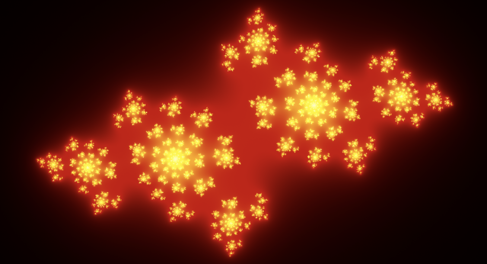
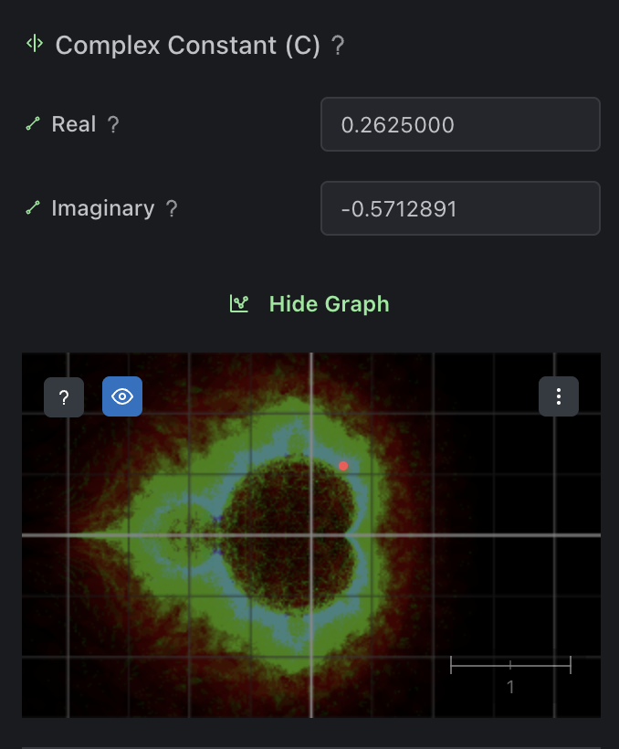

-- Short --

Test

-- Long --

## Introduction

Here you can create, animate, record and share your own fractals.

Here are the basic steps to do that:

#### Come up with a formula

Type in a formula. Generaly it must have `z` variable and `+ c` at the end.

Examples you can try:

`z^2 + c` - the classic Mandelbrot/Julia formula
`z^3 + c` - a cubic variant of the Mandelbrot/Julia formula
`sin(z)^2 + c` - a trigonometric variant
`z^-2 + c` - a reciprocal variant

You can click question mark near the formula input for details

#### Look for a good looking `Complex constant` value

Now find a good looking value for `Complex constant`(`c`).

Use graph to help you look for good values. You can hover your mouse to preview a value, click to set it as current `Complex constant` value.

Graph would have a map to show you which `c` values produce interesting fractals, the more colorful a particular area is, the more interesting the fractal is likely to be. It may not always be accurate, so feel free to explore on your own.

#### Animating `Complex constant` value

You can animate `Complex constant` by creating a range rule or a spline rule. Range rule will animate `c` between two values, while spline rule will allow you to create a custom animation path for `c` on a graph.

#### Pick a good coloring

Choose from a variety of coloring methods and customize them to your liking. 

#### Share your fractal

Share your fractal with others by clicking <icon>. Either put your fractal to the public gallery or share a link to your fractal directly